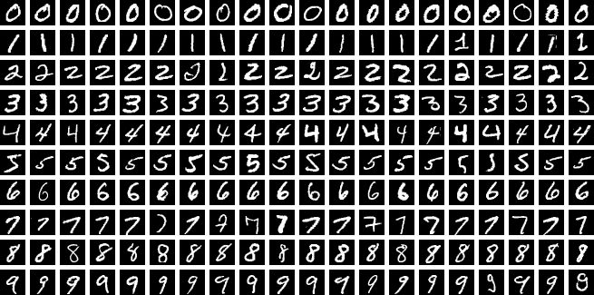

# MNIST CNN




## Overview

**MNIST CNN** is an interactive handwritten digit recognition project that demonstrates the power of convolutional neural networks (CNNs) using **PyTorch**. The system allows users to draw digits, see real-time predictions, and explore the internal workings of the model through visualizations.

Key highlights:

- CNN achieves **high accuracy** on MNIST (over 98% on test set).
- Interactive **Tkinter GUI** for drawing digits.
- Visualization of **input images**, **prediction probabilities**, and **feature maps** from the first convolutional layer.
- Graphs show **training progress** over epochs (accuracy and loss).

---

## Project Structure

```text
├── model.py        # CNN architecture
├── train.py        # Training script with graphs
├── draw.py         # GUI for drawing digits and visualization
├── graphs/         # Example plots (accuracy, loss, feature maps)
└── README.md
```

---

## Features

### Interactive Drawing & Prediction

- Draw digits directly on a 280x280 canvas.
- Real-time prediction of digits 0–9.
- Clear the canvas at any time to draw a new digit.

### Model Visualizations (Debug Mode)

- **Input image** as seen by the CNN.
- **Softmax probabilities** for all 10 digits.
- **Feature maps** from the first convolutional layer (reveals learned patterns).

### Training Progress

- Track **accuracy** and **loss** during training.
- Graphs illustrate how the CNN improves over epochs.

---

## Results & Visualizations

### Loss and Accuracy over 50 Epochs


### Debug Window (with number 1)


### Tkinter GUI Screenshot


---

## Learning Outcomes

By exploring this project, you will understand:

- How to implement and train a CNN in PyTorch.
- How to preprocess images for model input.
- How to integrate a PyTorch model with a **Tkinter GUI**.
- How to visualize **CNN internals** and **prediction probabilities**.
- How to interpret **training graphs** and model performance.

---

## Installation

```bash
git clone https://github.com/Aitaneuh/mnist-cnn.git
cd mnist-cnn
pip install -r requirements.txt
python train.py      # Train the model
python draw.py       # Launch the drawing GUI
```

---
